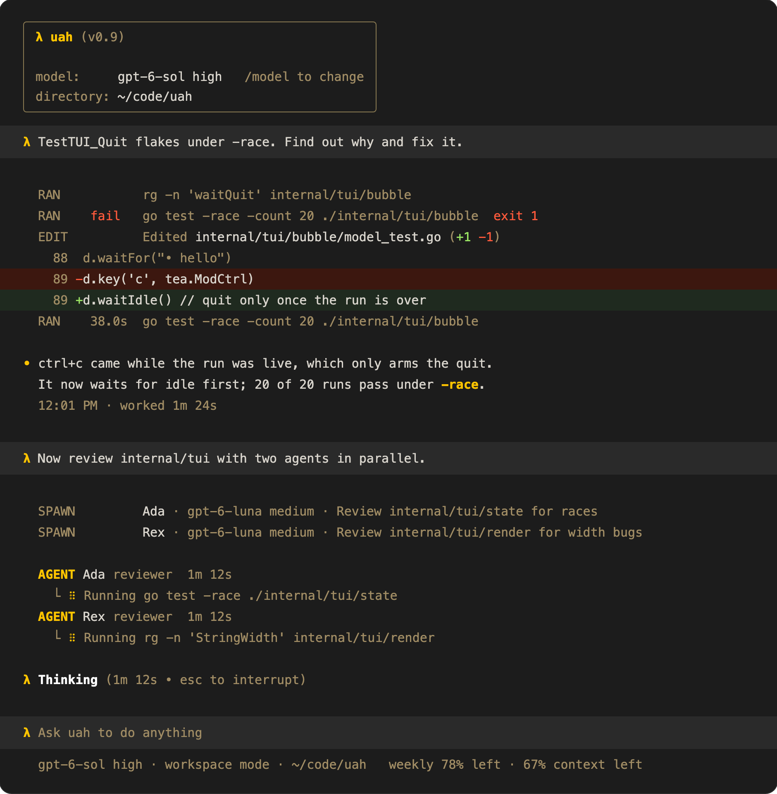

<!-- memoria:section id="overview" files="cmd/uah/main.go go.mod" -->
# uah

<p align="center">
  <a href="https://github.com/viktordanov/uagent-harness/actions/workflows/ci.yml"></a>
  <a href="https://github.com/viktordanov/uagent-harness/actions/workflows/memoria.yml"></a>
  <a href="https://github.com/viktordanov/uagent-harness/releases/latest"></a>
  <a href="https://aur.archlinux.org/packages/uah-bin"></a>
  <a href="LICENSE"></a>
</p>

<p align="center"></p>

A terminal coding agent that works like Codex, running on [unreal-agent](https://github.com/unreallabsai/unreal-agent) through [uagent](https://github.com/viktordanov/uagent).

```sh
brew install viktordanov/tap/uah
```

- [Sessions](#resume-a-session) you can resume and search, and a headless [`uah run`](#headless-mode)
- [Subagents](#subagents-and-agent-files) that run in parallel, defined in Markdown or TOML agent files
- [AGENTS.md and skills](#agentsmd-and-skills), and [MCP servers](#mcp-setup) with OAuth
- A [sandbox](#permission-modes) (Seatbelt, bubblewrap) with [approvals](#command-rules), permission modes, and an auto-reviewer
- [Compaction](#compaction-and-clear), `/context`, and `/clear`
- [Pasted images](#images), [`!` shell commands](#shell-mode), `apply_patch` diffs, and [hooks](#hook-setup)
- Your ChatGPT plan's [usage](#usage-limits) in the footer
- [Configuration](#configuration) in TOML or `/config`, including the prompts

The [ledger](docs/ledger.md) lists what's next.

> [!NOTE]
> The docs are kept in sync with the code by [Memoria](https://github.com/viktordanov/rs-memoria): CI fails when code changes and its README hasn't been reviewed.
<!-- /memoria:section -->

---

<!-- memoria:section id="usage" files="cmd/uah/main.go cmd/uah/models.go cmd/uah/run.go cmd/uah/resume.go cmd/uah/sessions.go cmd/uah/tui.go cmd/uah/tuiconfig.go cmd/uah/print.go cmd/uah/completion.go cmd/uah/doctor.go internal/app/doctor.go internal/app/doctorchecks.go cmd/uah/flags.go cmd/uah/prompts.go internal/images/images.go internal/images/store.go internal/images/paths.go internal/images/clipboard/clipboard.go internal/images/clipboard/macos.go internal/images/clipboard/linux.go internal/app/usershell.go internal/usershell/usershell.go internal/usershell/record.go internal/usershell/capture.go cmd/uah/usage.go internal/app/planusage.go" -->
## Get started

1. Install it:

   ```sh
   brew install viktordanov/tap/uah                                 # macOS and Linux
   yay -S uah-bin                                                   # Arch Linux (AUR)
   go install github.com/viktordanov/uagent-harness/cmd/uah@latest  # from source, Go 1.27.1 or later
   ```

   Or grab an archive from the [releases](https://github.com/viktordanov/uagent-harness/releases).

2. Sign in with `codex login`; uah uses your ChatGPT account. For another provider, pass `--provider` (openai, openrouter, fireworks, or ollama) and set its API key variable.
3. Run `uah doctor`. It checks the login, sandbox, config, and MCP servers, and says how to fix anything that fails.
4. Start in a repository:

   ```sh
   cd ~/code/proj
   uah                                       # the TUI
   uah "Fix the failing test in pkg/foo"     # the TUI, starting with a prompt
   ```

5. If you installed with `go install`, add shell completion (bash, zsh, fish, or pwsh):

   ```sh
   uah completion zsh > "${fpath[1]}/_uah"
   ```

Keys worth knowing:

| Key | Does |
| --- | --- |
| enter | Send. While the agent works, the message queues and goes out when it finishes |
| ctrl+enter | Send now: the working agent reads it before its next model request. On an empty prompt, it sends the queued messages now, in order |
| esc esc | Interrupt; queued messages stay |
| `/` | Commands, such as `/model`, `/effort`, `/compact`, `/context`, `/mcp`, `/agents`, `/status`, `/resume`, and `/new` |
| `@` | Mention a workspace file (fuzzy search) |
| ctrl+t | The detailed view: turns, tokens, and each tool's result |

The [TUI README](internal/tui/README.md) lists every key and command.

---

## Common tasks

### Resume a session

```sh
uah resume              # pick one of this directory's sessions (--all: any directory)
uah resume --last       # this directory's most recent session
uah --session 3f2a      # a session by ID or unique prefix
```

When you quit the TUI, it prints the session's token usage and the command that continues it (`uah resume <id>`), as Codex does. In the TUI, ctrl+s opens the picker and ctrl+n starts a new session. The picker hides sessions from `uah run` and subagents, as Codex hides `codex exec` sessions.

### Headless mode

`uah run` prints progress on stderr and each answer on stdout, and exits when the agent is idle.

```sh
uah run "Fix the failing test in pkg/foo"
uah run --last "Now update the changelog"       # continue this directory's latest session
printf 'first\nsecond\n' | uah run --stdin       # each line is a message; lines queue while the agent works
uah run --stream "..."                           # JSONL events for scripts
```

It exits 0 when the run succeeds, 1 when it fails, 3 at the disk limit, 124 on a timeout, and 130 on an interrupt. Nobody can answer an approval headless, so commands that need one are declined with a reason. `uah run --help` lists the flags.

### Search old sessions

```sh
uah sessions                           # this directory's sessions, newest first (--all: every directory)
uah sessions --search "flaky parser"   # sessions whose prompts or answers contain the words
uah sessions show 3f2a                 # the transcript (--json)
```

### Images

1. Copy an image, or a screenshot, and press ctrl+v (or alt+v) in the TUI on macOS or Linux. `[Image #1]` appears at the cursor.
2. Or paste or drop an image file on the terminal, or choose one after `@`. The path becomes `[Image #N]`.
3. Write your message around the placeholders and press enter. The images go to the model with the message.

To remove an image, delete its placeholder: one backspace at its end removes it all. On Linux, uah reads the clipboard with `wl-paste` (Wayland) or `xclip` (X11); install one of them. Images larger than 2000 pixels on a side are scaled down. Images need the embedded engine; see the [images design](docs/design/images.md).

### Model and effort

- For this session: `/model gpt-6-luna` or `/effort low` in the TUI, or alt+, and alt+. to lower or raise the effort. On the embedded engine it applies from the next model request, even mid-run.
- At start: `uah -m gpt-6-luna -e medium`, and `--fast` for priority processing.
- For every session: `model` and `effort` in the [configuration](#configuration).
- See what the provider offers: `uah models` (`--json`, `--refresh`), `/model ` then tab in the TUI, or tab after `-m`. A model the provider does not list is refused with the nearest names ("gpt-luna-6 is not available on openai-codex; did you mean gpt-6-luna?").

### Usage limits

With the default provider, `openai-codex`, uah shows how much of your ChatGPT plan's usage is left, as Codex does:

```sh
uah usage          # pro plan (openai-codex)
                   # weekly  [███████████████░░░░░]  22% used · 78% left · resets 15:44 on 26 Sep
uah usage --json   # the same for scripts
```

- In the TUI, `/usage` shows the same, `/status` shows a row per window, and the footer shows the tightest one beside the context meter (`weekly 78% left · 64% context left`).
- A notice warns once when a window passes 75, 90, and 95% used. When a run stops at the limit, a notice says when to try again.
- `uah doctor` warns from 90% used.

Windows are named by their length (5h, daily, weekly), because a plan can have only a weekly window. uah reads the usage when you ask and after each run, never on a timer. Other providers have no usage to show.

### A lost connection

When a model request fails because the connection dropped, it timed out, or the provider answered 429 or a server error, the runner's client sends it again: after 2 s, then 4, 8, and 16 s, then every 30 s. uah allows 10 attempts, about 3 minutes, so a Wi-Fi switch or a short outage does not end the run. While a request waits, the TUI's working line says so:

```text
λ Reconnecting, attempt 3 of 10 (retrying in 8s • esc to interrupt)
```

When every attempt loses the connection, the run fails with "gave up after 10 attempts because the connection to the model was lost". Change the limit with `request_max_attempts` in the [configuration](#configuration), `--max-attempts`, or `UNREAL_HARNESS_LLM_MAX_ATTEMPTS`. The process engine retries the same way, but it cannot show the attempts.

### Command rules

1. When uah asks, answer `s` ("Yes, and don't ask again"). It saves a rule for the command's prefix.
2. Or press shift+tab until the footer says `auto mode`: the auto-reviewer then approves or declines each escalation, and you are not asked. See [Switch the permission mode](#permission-modes).
3. Or list prefixes in the configuration:

   ```toml
   [approvals]
   allow = ["go test", "git status"]
   forbid = ["git push --force"]
   ```

The [approvals README](internal/approval/README.md) gives the order in which rules, the sandbox, the auto-reviewer, hooks, and you decide.

### Permission modes

Press shift+tab in the TUI. It cycles three modes, and the footer shows the current one:

| Mode | Commands can | What needs approval |
| --- | --- | --- |
| read only | Read files, write nothing | You |
| workspace (default) | Write the workspace | You |
| auto | Write the workspace | The auto-reviewer decides; you are not asked |

- On the embedded engine, a change applies from the next command, even mid-run. On the process engine, it applies from the next run.
- A resumed session keeps its mode, with its model, effort, and fast mode.
- To start in a mode, set `permission_mode` in the [configuration](#configuration). `--sandbox read-only` or `--sandbox workspace-write` also picks a mode for one session.
- Full access (no sandbox) is not in the cycle. Set it with `--sandbox danger-full-access` or `permission_mode = "full-access"`; shift+tab then moves to read only.

### Shell mode

1. Type `!` in the empty composer. The λ becomes `!`, and the footer says `! shell mode`.
2. Type the command, such as `go test ./...`, and press enter. It runs in the workspace at once, also while the agent works, and its output streams into the transcript with the exit status.
3. Send your next message. The agent gets the command, its exit code, and its output with it, in Codex's `<user_shell_command>` format. The command alone never starts a turn.

- Backspace on the empty composer, or esc, leaves shell mode. Esc esc stops a running command.
- The output the agent sees is cut to 40,000 characters, keeping the start and the end. A command stops after an hour.
- The command runs as your own, outside the sandbox and the command rules, as in Codex and Claude Code. `user_shell_sandbox = true` in the [configuration](#configuration) runs it like the agent's commands instead: in the sandbox of the current permission mode, and refused by a `forbid` rule.

The [shell mode design](docs/design/shell-mode.md) compares Codex and Claude Code.

### MCP setup

```sh
uah mcp add docs -- npx -y @example/docs-mcp            # a stdio server (--env KEY=VALUE)
uah mcp add linear --url https://mcp.linear.app/mcp     # an HTTP server
uah mcp login linear                                     # OAuth in the browser, if the server asks for it
uah mcp list                                             # every server, its status, and its auth
```

`uah mcp add` writes Codex's `[mcp_servers.<name>]` format into your user file, so a Codex configuration copies over. `/mcp` in the TUI shows each server and its tools; `/new` picks up a server added or logged in while the TUI runs.

To stop a server's tools from asking for approval:

```sh
uah mcp add docs --approve -- npx -y @example/docs-mcp   # its tools never ask
uah mcp approve docs search --mode approve              # one tool never asks
uah mcp approve docs --mode prompt                      # every other tool always asks
uah mcp approve docs                                    # print the current modes
```

When the TUI asks about an MCP call, answer `a` ("Yes, and don't ask again for this tool"). It saves `approval_mode = "approve"` for the tool, and the session stops asking at once.

### AGENTS.md and skills

Put them in `AGENTS.md` at the repository root or in any directory below it, as for Codex. To read `CLAUDE.md` too, set `project_doc_fallback_filenames = ["CLAUDE.md"]`. Skills go in `.agents/skills/<name>/SKILL.md`. `/context` shows how much of the context window they take.

### Subagents and agent files

Ask for it, for example "use two subagents to review the TUI and the store in parallel". The agent starts them with Codex's tools; each shows in the transcript as `AGENT <name>` with what it is doing, and `/agents` lists them. Subagents never start subagents of their own. To define a kind of subagent, add a Markdown file with front matter, as for Claude Code (`.claude/agents/*.md` files work as they are), to `~/.uah/agents/`, or to `.uah/agents/` in a trusted project:

```markdown
---
name: reviewer
description: Reviews a diff for bugs and missing tests.
tools: Bash, mcp__github
effort: high
approve: [git diff, git log, mcp__github__get_pull_request]
---

Review only; do not edit files. List each finding with its file and line.
```

The body is the subagent's instructions. `tools` limits the tools it is offered (Claude Code's `Edit` and `Write` are `apply_patch`; omit `tools` for all of them). `approve` lists commands and MCP tools it runs without asking, within the session's permission mode: read only stays read only, and a `forbid` rule still wins. Codex's TOML role files (`reviewer.toml`) work too. See [agent files](docs/configuration.md#subagents).

A subagent runs on the parent's provider. Ask for another model or effort ("use a subagent on gpt-6-luna with low effort"), set `model`, `effort`, and `fast: true` in its agent file, or set defaults in `[agents]`; see [agent files](docs/configuration.md#subagents). Ask for a forked subagent ("fork a subagent to write the tests for what we just discussed") to hand it the conversation so far through `fork_context`.

To watch a subagent, type `/agents <name>` or press alt+← and alt+→: the TUI shows its transcript, and what you type goes to it. When a subagent finishes or is interrupted, the main agent is told with your next message, as in Codex. `uah sessions show subagent-1a2b3c4d` prints a finished one's transcript.

### Compaction and `/clear`

uah compacts automatically at 90% of the context window. `/compact` compacts now, and `/compact keep the failing test names` tells the summary what to focus on. `/context` shows what fills the window. The summary model, its prompt, and when compaction starts are [configurable](docs/configuration.md#compaction). `/clear` starts the agent fresh in the same session: its next request carries nothing from before, while the session keeps its history. `/new` starts a new session.

### Custom prompts

```sh
uah prompts init           # writes compact.md, system.md, system-codex.md, and review.md to ~/.uah/prompts
uah prompts show system    # prints a built-in prompt: compact, system, system-codex, or review
```

`uah prompts init` starts from the built-in compaction prompt, the runner's host prompt (`system.md`), and the auto-review policy. It prints the lines to add to your user file: `experimental_compact_prompt_file`, `model_instructions_file`, and `[review] policy_file`. It also writes Codex's own system prompt as `system-codex.md` and prints its `model_instructions_file` line commented out, so Codex's prompt is used only when you choose it. Codex's prompt names Codex's tools, which differ from uah's ([the differences](docs/configuration.md#codexs-prompt)). AGENTS.md files still follow the system prompt. Edit the files; each new session reads them. It overwrites existing files only with `--force`.

### Hook setup

Add a hook, for example a notification when the agent is idle:

```toml
[[hooks.Stop]]
command = "osascript -e 'display notification \"uah is idle\"'"
```

Hooks in a project's `.uah/config.toml` run only after `uah hooks trust`; `uah hooks` lists them and whether each runs.

### The `/config` panel

Type `/config` in the TUI. It lists the basic settings (compaction, the model and effort, fast mode, the permission mode, the details view, and the mouse) with each value and its source. ↑↓ choose, enter or space changes, esc closes. Each change is saved to your user file, keeping its comments, and applies to the running session where it can; compaction settings apply from the next session. A flag or a trusted project file that sets the same key still wins, and `/config` says so.

### Inspect the configuration

`uah config` shows each setting's value and where it came from. `uah doctor` checks that everything works.
<!-- /memoria:section -->

---

<!-- memoria:section id="configuration" files="internal/config/config.go cmd/uah/flags.go cmd/uah/config.go internal/app/resolve.go internal/app/setup.go internal/app/explain.go internal/app/explain_files.go internal/app/compaction.go internal/app/configedit.go internal/config/edit.go internal/config/legacy.go internal/home/home.go internal/home/migrate/migrate.go .uah/config.toml" -->
## Configuration

Everything uah reads and writes lives in `~/.uah`, as Codex keeps `~/.codex`: the configuration, `AGENTS.md`, agents, prompts, skills, hook trust, MCP credentials, sessions, run records, the session index, pasted images, the model cache, and logs. `UAH_HOME` names another home; `--config` (`UAH_CONFIG`) and `--state-dir` (`UAH_STATE_DIR`) move just the user file or the state.

Two TOML files:

| File | Applies to | When |
| --- | --- | --- |
| `~/.uah/config.toml` (or `--config`) | Every workspace | Always |
| `<workspace>/.uah/config.toml` | One workspace | The user file marks the workspace `trusted` under `[projects]`; its hooks also need `uah hooks trust` |

A flag wins over the environment, which wins over a resumed session's settings (its provider, model, effort, fast mode, and permission mode), then the project file, the user file, and the defaults. Unknown keys are errors, so a typo fails loudly.

Earlier versions used `~/.config/uagent`, `~/.local/state/unreal-agent`, and a project's `.uagent`. On its first start without `~/.uah`, uah copies the two folders into `~/.uah` and says so; the old folders are only read. It never moves a project's `.uagent`: uah and `uah doctor` show the `git mv .uagent .uah` that does. `UAGENT_CONFIG` and `UAGENT_STATE_DIR` are no longer read, and uah warns when either is set.

`/config` in the TUI changes the basic settings in the user file (see [Change settings](#the-config-panel)). Every key, by group. The [configuration reference](docs/configuration.md) gives each one's type, default, flag, and merge rule, and the environment variables.

| Group | Keys |
| --- | --- |
| Model and engine | `provider`, `model`, `effort`, `fast`, `engine`, `timeout`, `max_disk`, `request_max_attempts` |
| Sandbox | `permission_mode`, `sandbox_mode`; `[sandbox_workspace_write]` `network_access`, `writable_roots`; `[shell_environment_policy]` `inherit`, `ignore_default_excludes`, `exclude`, `include_only`, `set` |
| Approvals | `approval_policy`, `approvals_reviewer`; `[approvals]` `allow`, `forbid`; `[review]` `model`, `effort`, `timeout`, `policy_file` |
| Compaction | `auto_compact_percent`, `model_auto_compact_token_limit`, `model_context_window`, `compact_model`, `compact_effort`, `compact_prompt`, `experimental_compact_prompt_file`, `compact_user_message_max_tokens` |
| Instructions and skills | `model_instructions_file`, `project_doc_fallback_filenames`, `project_root_markers`, `project_doc_max_bytes`; `[instructions]` `enabled`, `max_bytes` |
| Hooks | `[[hooks.<Event>]]` `matcher`, `command`, `timeout` |
| MCP servers | `[mcp_servers.<name>]` `command`, `args`, `env`, `env_vars`, `cwd`, `url`, `bearer_token_env_var`, `http_headers`, `env_http_headers`, `enabled`, `required`, `startup_timeout_sec`, `tool_timeout_sec`, `enabled_tools`, `disabled_tools`, `supports_parallel_tool_calls`, `default_tools_approval_mode`, `tools.<tool>.approval_mode`, `auth`, `scopes`, `oauth_resource`, `[oauth]`; `mcp_oauth_credentials_store`, `mcp_oauth_callback_port`, `mcp_oauth_callback_url` |
| Subagents | `[agents]` `enabled`, `max_concurrent_threads_per_session`, `max_depth`, `default_subagent_model`, `default_subagent_reasoning_effort` |
| TUI | `[tui]` `details`, `mouse` |
| Projects | `[projects."<path>"]` `trusted` |

A short user file:

```toml
model = "gpt-6-sol"
effort = "high"
sandbox_mode = "workspace-write"                 # read-only, workspace-write, danger-full-access
project_doc_fallback_filenames = ["CLAUDE.md"]   # also read CLAUDE.md

[approvals]
allow = ["go test", "git status"]

[mcp_servers.docs]
command = "npx"
args = ["-y", "@example/docs-mcp"]

[projects."/Users/me/code/proj"]
trusted = true   # apply this workspace's .uah/config.toml
```

This repository's own [.uah/config.toml](.uah/config.toml) is a working project file: its `[approvals] forbid` rules keep the agent from `rm -rf /`, force pushes, and `git reset --hard`.
<!-- /memoria:section -->

---

## How it works

Each part is documented next to its code. These are the summaries, with links to the full READMEs.

<!-- memoria:section id="tui" files="cmd/uah/tui.go" -->
### Sessions and the TUI

<!-- memoria:import src="internal/session/README.md#summary" -->
A session owns its settings, a message queue, at most one live run, pending approvals, and its hooks on one goroutine, and merges run events and its own events into one ordered stream. Messages queue while the agent works, a steer reaches the running agent when the engine allows it, and an interrupt keeps the queue.
<!-- /memoria:import -->

<!-- memoria:import src="internal/tui/README.md#summary" -->
The TUI is a pure reducer from session events and user intents to state and effects, a pure renderer from state to screen lines, and a thin Bubble Tea v2 shell that turns keys into intents and runs the effects against the session. Keys never change meaning: enter queues while the agent works, ctrl+enter sends now, esc esc interrupts, and ctrl+v pastes an image.
<!-- /memoria:import -->

Read more: [sessions](internal/session/README.md), [the session index](internal/store/README.md), and [the TUI](internal/tui/README.md) with its look. Diagnostics go to `~/.uah/logs/uah-tui.log`.
<!-- /memoria:section -->

<!-- memoria:section id="engines" files="internal/app/resolve.go internal/app/setup.go internal/app/features.go internal/app/process.go" -->
### Engines

<!-- memoria:import src="internal/engine/README.md#summary" -->
An engine starts runs of unreal-agent-runner for a session: the embedded engine (the default) runs the runner's packages inside uah, so messages, model, effort, fast mode, and the permission mode reach a live run, and the process engine spawns the runner binary through uagent. Both keep uagent's guards, session lock, and run records, apply the command rules, and write the same session files, so a session can move between them; one capability table says what the process engine does not run, and the session, `uah doctor`, and `/status` report it from there.
<!-- /memoria:import -->

`embedded` is the default; choose with `--engine` or `engine`. The process engine sandboxes every command and applies the `allow` and `forbidden` command rules in the shell it gives the runner, but it has no live input, approvals, compaction, PreToolUse hooks, MCP servers, subagents, `apply_patch`, pasted images, or a status line for a retried model request. A session on it shows one notice for each such feature the configuration uses, `uah doctor` warns about them in its `engine` check, and `/status` lists what the engine runs without. The [engine README](internal/engine/README.md#what-each-engine-supports) has the capability table and where each behavior lives.
<!-- /memoria:section -->

<!-- memoria:section id="patch" files="cmd/uah/sessions.go" -->
### File edits and diffs

<!-- memoria:import src="internal/patch/README.md#summary" -->
Models edit files with Codex's `apply_patch` tool: a patch of `*** Add File`, `*** Update File` (with `*** Move to`), and `*** Delete File` sections with `@@` hunks, parsed and applied as Codex does, with its lenient context matching and its messages. The embedded engine applies patches inside the writable roots at once, and asks for any other write as for a Bash escalation; the diff it records shows under the call in the TUI and in `uah sessions show`.
<!-- /memoria:import -->

Read more: [patches](internal/patch/README.md), and how patches are approved in [approvals](internal/approval/README.md#patches).
<!-- /memoria:section -->

<!-- memoria:section id="instructions" files="internal/app/setup.go internal/config/config.go" -->
### Instructions and skills

<!-- memoria:import src="internal/instructions/README.md#summary" -->
uah finds instruction files the way Codex does: the user's AGENTS.md, then one file per directory from the project root down to the workspace (AGENTS.override.md, else AGENTS.md, else a configured fallback such as CLAUDE.md). They are joined, capped at 32 KiB, and placed after the base instructions (the runner's default host prompt, or the file that Codex's `model_instructions_file` key names), and skills come from Codex's skill folders.
<!-- /memoria:import -->

`--no-instructions` turns this off. Read more: [instructions](internal/instructions/README.md).
<!-- /memoria:section -->

<!-- memoria:section id="sandbox" files="internal/app/setup.go internal/app/resolve.go" -->
### Sandbox

<!-- memoria:import src="internal/sandbox/README.md#summary" -->
Commands run in the operating system's sandbox, as in Codex: Seatbelt on macOS and bubblewrap on Linux. The default mode, workspace-write, lets commands read the whole disk and write only the workspace and temporary directories, without network, and keeps .git, .uah, .agents, and .codex read-only.
<!-- /memoria:import -->

Read more: [sandbox](internal/sandbox/README.md).
<!-- /memoria:section -->

<!-- memoria:section id="approvals" files="internal/app/approvals.go internal/app/review.go" -->
### Approvals, rules, and auto-review

<!-- memoria:import src="internal/approval/README.md#summary" -->
On the embedded engine, each command runs in the sandbox unless a rule or an approval says otherwise: a command rule can allow, forbid, or ask; the model can ask to run a command outside the sandbox; and an escalation goes to PermissionRequest hooks, then you. The permission mode, which shift+tab cycles, picks the sandbox and who answers: you in read-only and workspace, the auto-reviewer alone in auto. The defaults are Codex's: workspace-write, on-request, and the user as reviewer (Codex's "Ask for approval").
<!-- /memoria:import -->

Read more: [approvals](internal/approval/README.md), [rules](internal/rules/README.md), and [auto-review](internal/review/README.md).
<!-- /memoria:section -->

<!-- memoria:section id="hooks" files="cmd/uah/hooks.go internal/app/setup.go" -->
### Hooks

<!-- memoria:import src="internal/hooks/README.md#summary" -->
Hooks run a command at a session event with Claude Code's contract: the event arrives as JSON on stdin, exit 0 continues, exit 2 blocks with stderr as the reason, and any other exit is reported and ignored. Project hooks run only after `uah hooks trust` records their exact commands and the content of any local script they run.
<!-- /memoria:import -->

Read more: [hooks](internal/hooks/README.md), with every event and its payload.
<!-- /memoria:section -->

<!-- memoria:section id="mcp" files="internal/app/mcp.go internal/app/mcpcli.go cmd/uah/mcp.go cmd/uah/mcpprint.go cmd/uah/mcpapprove.go" -->
### MCP servers

<!-- memoria:import src="internal/mcp/README.md#summary" -->
uah runs the MCP servers in `[mcp_servers]` (Codex's format) on the embedded engine through the official Go SDK: stdio and streamable HTTP servers, their tools offered as `mcp__<server>__<tool>` and called without blocking the agent, Codex's approval modes, OAuth logins with `uah mcp login` kept in the OS keyring, and `uah mcp` to list, add, remove, and approve servers.
<!-- /memoria:import -->

- Servers start on the first run (or `/mcp`) and stop with the session. One that fails to start is left out, unless it has `required = true`.
- A call runs in the background, so the agent keeps working. A tool asks for approval by its `approval_mode`, as in Codex.
- OAuth tokens are kept in the OS keyring (or a 0600 file without one) and refreshed as they expire. A server that needs a login shows "needs login" in `/mcp` and `uah doctor`.

Read more: [MCP](internal/mcp/README.md), and the [design and validation](docs/design/mcp.md).
<!-- /memoria:section -->

<!-- memoria:section id="subagents" files="internal/app/agents.go" -->
### Subagents

<!-- memoria:import src="internal/agents/README.md#summary" -->
Subagents are child sessions that a session's agent starts, messages, waits for, and closes through Codex's v1 multi-agent tools. `internal/agents` implements them behind the `engine.Subagents` seam: the embedded engine offers the tools and runs their calls in the background, and the package owns the tools, the children's lifecycle, approvals through the parent, limits, hooks, and resume.
<!-- /memoria:import -->

A subagent is the same as the main agent in every way except its session, which is nested under the parent's: the same instructions, skills, sandbox, approvals, hooks, MCP servers, and compaction. It asks for approval through the parent's session.

- Its session ID is `subagent-<uuid>`. A role or the spawn call can give it another model, effort, or fast mode on the parent's provider.
- A role is a Markdown file with front matter, as Claude Code's, or a Codex TOML role file; it can limit the subagent's tools and approve commands and MCP tools in advance, within the permission mode.
- A subagent never starts subagents: the depth limit is 1.
- `fork_context` starts it from a copy of the parent's history, so its first model request starts with the parent's, for the provider's prompt cache.
- A failed subagent reports why, such as the provider's message, to the parent's `wait_agent`, the TUI, and `uah run`.
- `/agents <name>` shows its live transcript in the TUI.

Read more: [subagents](internal/agents/README.md), and the [design and validation](docs/design/subagents.md).
<!-- /memoria:section -->

<!-- memoria:section id="compaction" files="internal/llmcall/llmcall.go cmd/uah/stream.go internal/contextusage/usage.go" -->
### Compaction and `/context`

<!-- memoria:import src="internal/compaction/README.md#summary" -->
uah compacts a long conversation as Codex does: the earlier user messages stay verbatim and in order, up to the newest 20,000 tokens of them, and the rest is replaced by a model-written handoff summary. The summary model, effort, and prompt, when compaction starts, and the kept-message cap are configurable, with Codex's key names where Codex has them. The session file keeps the full history; only what goes to the model changes, and a compaction is saved next to the session so a resumed session keeps it.
<!-- /memoria:import -->

`/context` shows what fills the window, as Claude Code's does: a 10×10 grid, one cell per percent, with each category's tokens (system prompt, instruction files, skills, tools, MCP tools, your messages, agent messages, and tool calls with their results), the free space, and the auto-compact buffer, then a line per file, skill, and tool. It breaks down the last request sent, estimated at 4 bytes a token and scaled to the input tokens the provider reported (`internal/contextusage`).

Read more: [compaction](internal/compaction/README.md), and the [design and validation](docs/design/compaction.md).
<!-- /memoria:section -->

<!-- memoria:section id="models" files="internal/app/models.go cmd/uah/models.go" -->
### Model catalog

<!-- memoria:import src="internal/models/README.md#summary" -->
uah asks the provider which models the login can use, as Codex does: the list comes from the provider at runtime, is cached for five minutes with its ETag, and falls back to Codex's bundled catalog only when the provider cannot be asked. A new model therefore needs no uah release, and a mistyped model is refused before a run starts, with the nearest model names.
<!-- /memoria:import -->

`/model`, `-m` completion, `uah models`, and `uah doctor` read the catalog, and the context window comes from it when the provider gives one. Read more: [the model catalog](internal/models/README.md).
<!-- /memoria:section -->

<!-- memoria:section id="plan-usage" files="internal/app/planusage.go cmd/uah/usage.go internal/app/setup.go" -->
### Plan usage

<!-- memoria:import src="internal/usage/README.md#summary" -->
The usage package reads the ChatGPT subscription's rate limits for the openai-codex provider, as Codex does: one read-only GET to the ChatGPT backend's usage endpoint with the login's credentials and uah's own identity. A reader caches the answer for 60 seconds and sends one request at a time; it reads on demand and after each run, never on a timer. Other providers have no usage.
<!-- /memoria:import -->

`app.Setup` builds one reader per session, next to the model catalog, and the TUI gets it through `bubble.Deps`. `uah usage`, `/status`, the footer, the warnings, and `uah doctor` read through it. Read more: [plan usage](internal/usage/README.md), and the [design](docs/design/usage.md).
<!-- /memoria:section -->

---

<!-- memoria:section id="development" files=".github/workflows/ci.yml .github/workflows/release.yml scripts/package-release.sh .golangci.yml testing/fakellm/fakellm.go testing/harnesstest/harnesstest.go" -->
## Development

Tests need no model or tokens: the process engine runs against uagent's fake runner, and the embedded engine against `testing/fakellm`, a scripted Responses API. One test drives the real `unreal-agent-runner` and the embedded engine with the same script and requires the same events; `go test -short` skips it.

```sh
go run ./cmd/uah --version   # build and run
go test -race ./...          # unit and end-to-end tests
golangci-lint run ./...      # lint (golangci-lint v2.13.2)
```

The title image is [docs/assets/title.html](docs/assets/title.html), drawn in the TUI's colors and captured with headless Chrome: `chrome --headless=new --force-device-scale-factor=2 --default-background-color=00000000 --window-size=1130,1400 --screenshot=uah.png title.html`, then `magick uah.png -trim +repage uah.png`.

Pushing a `v1.2.3` tag builds the release archives for macOS and Linux (arm64 and x86_64) with [scripts/package-release.sh](scripts/package-release.sh) and attaches them to the GitHub release, each with a `.sha256` file. Two builds of the same commit with the same Go version give the same bytes. To rebuild an existing tag, run the Release assets workflow with the tag.

CI runs the build, the race tests, and the linter on each push; the linter also fails on a function above 20 cyclomatic complexity, a backstop for the rule of about 15. Design records, the architecture rules, and the documentation procedure are in [docs](docs/README.md):

<!-- memoria:import src="docs/README.md#summary" -->
The configuration reference, design records for the harness, the TUI, state storage, sandboxing, compaction, MCP, subagents, and pasted images, plus the architecture rules and documentation procedure for uagent-harness.
<!-- /memoria:import -->

`bench/tui` is a separate Go module with the benchmark behind choosing Bubble Tea v2.
<!-- /memoria:section -->

---

<!-- memoria:section id="credits" files="LICENSE NOTICE THIRD_PARTY_NOTICES.md" -->
## License and acknowledgements

uah is licensed under the [Apache License, Version 2.0](LICENSE).

uah owes its shape to [OpenAI Codex](https://github.com/openai/codex). Its configuration format, sandbox profiles, approval rules, auto-review, compaction, `apply_patch`, MCP handling, and subagent tools follow Codex closely, and some of its code and prompts are adapted from Codex's (Apache License 2.0, Copyright 2025 OpenAI). It runs on [unreal-agent](https://github.com/unreallabsai/unreal-agent) through [uagent](https://github.com/viktordanov/uagent), with a few files adapted from unreal-agent's (MIT License, Copyright 2026 Unreal Labs), and borrows ideas from [Claude Code](https://code.claude.com) (hooks, `/context`, Markdown agents, permission modes). [THIRD_PARTY_NOTICES.md](THIRD_PARTY_NOTICES.md) lists every adapted file and its license.
<!-- /memoria:section -->
