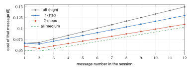
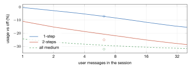

# Adaptive effort in long sessions: usage, time, and accuracy

What two prompt caches cost, what lower effort saves, and how far the numbers carry. Measured 2026-10-02 with gpt-6.1-sol; the data is in `tools/agentbench/history/2026-10-02-multiturn*.jsonl`, and the benchmark runs are described in [agent tuning](agent-tuning.md).

## In one paragraph

Adaptive effort runs the request after your message at the effort you chose ($E$, here high) and the follow-ups that only carry tool results one or two steps lower. OpenAI keeps a separate prompt cache **per effort**, so an adaptive session keeps two caches, and every switch makes the cache it switches to catch up. That catch-up is a fixed, predictable cost per message. Lower effort also writes less, so the conversation grows more slowly, and every later request re-reads less. Over chat sessions of 6–7 messages, the second effect wins: **1-step uses 7% less and is 24% faster; 2-steps uses 25% less and is 40% faster; every run passed in every group.** A three-term model reproduces these numbers within about 2 points and says the advantage grows with session length.

## Results

Five chat tasks (Go and Python repos, 6–7 messages each, real read/edit/test work on every message), 5 repeats each, 25 sessions per group, gpt-6.1-sol, uah only, auto mode.

| | off (all high) | 1-step | 2-steps | all medium |
|------------------------------------|--------------:|--------------:|--------------:|--------------:|
| **Usage** (API-price weighted) | 100% | **93%** | **75%** | 68% |
| **Time** per session | 810 s | **619 s (−24%)** | **485 s (−40%)** | 536 s (−34%) |
| Time per user message | 131 s | 100 s | 78 s | 86 s |
| **Accuracy** (checks passed) | 25/25 | 25/25 | 25/25 | 25/25 |
| Requests per message | 5.6 | 5.5 | 5.3 | 5.3 |

Usage is the bill at API prices (uncached input \$1.25, cached input \$0.125, output \$10 per million tokens). Section *Usage on a subscription* shows how the result changes if a plan weighs tokens differently. Three runs first failed on a flaw in one task's check (it restored a test file the agent had legitimately extended); with the check fixed, all pass. A sixth task, where only the "off" group compacted its context, is left out of this table so the groups compare like for like; with it, the totals are −16% / −31% / −35% usage and −31% / −45% / −37% time.

## Why there is a cost at all: two caches

A controlled test settles the mechanism: the same 33k-token prompt sent twice is **99.5% cached** at the same effort and **0% cached** when the effort changes (28 of 28 pairs), and each effort's cache survives the other's use.

## The model, simply

Every request re-reads the whole conversation, so **each message costs more than the one before it**: the conversation is longer. Adaptive effort changes three things:

1. **It adds a fixed catch-up per message**, the previous message's tool work re-billed uncached: about \$0.011 per message at 1-step.
2. **It writes less per message** (output is the most expensive token): about \$0.009 saved per message at 1-step.
3. **It makes the conversation grow more slowly**, so every later request re-reads less. This saving is small at first and **grows with every message**.

At 1-step, (1) and (2) nearly cancel, and (3) decides; at 2-steps, (2) alone already beats (1). The chart shows the resulting cost of each message:

The lines start almost together and spread apart: the slope is the conversation's growth rate, and lower effort flattens it. The catch-up shifts the adaptive lines up by a constant amount, which matters less with every message.

### The full equation

For a session with $m$ user messages and $N \approx k\,m$ requests:

$$
\underbrace{\text{usage}}_{\$} \;=\; \underbrace{c\left(N P + \tfrac{1}{2}\,g\,N^2\right)}_{\text{re-reading the conversation}} \;+\; \underbrace{(u-c)\,\beta\,N g}_{\text{new content, uncached}} \;+\; \underbrace{(u-c)\,(m-1)\,k\,g}_{\text{catch-up (adaptive only)}} \;+\; \underbrace{w\,N o}_{\text{output}}
$$

| Symbol | Meaning | Value |
|----------|------------------------------------------|------------------------------------------|
| $u,\ c,\ w$ | price of uncached input, cached input, output | \$1.25, \$0.125, \$10 per M |
| $k$ | requests per message | $\approx 5.5$ |
| $P$ | the first request's prompt | $\approx$ 12.6k tokens |
| $g$ | conversation growth per request | 2157 (high), 1722 (1-step), 1452 (2-steps, medium) |
| $o$ | output per request | 578 (high), 423 (1-step), 339 (2-steps), 383 (medium) |
| $\beta$ | ordinary misses beyond new content | 1.22, fitted on the "off" group only |

(The exact form also counts the lowered effort's first, empty-cache request once per session.)

**Time** follows an even simpler rule. Per request, measured over 3,400 requests:
$$
t_{\text{request}} \;\approx\; 3.8\,\text{s} \;+\; 31\,\text{ms} \times \text{output tokens} \qquad (R^2 = 0.98)
$$
Uncached input adds only about 0.03 ms per token, so a 10k-token catch-up costs about **0.3 s**: the second cache costs usage, not time. Time saved is almost entirely output not written, so the percentage stays the same at any session length.

## How well the model matches

| Group | Usage observed | Usage model | Time observed | Time model |
|---|---:|---:|---:|---:|
| 1-step vs off | −7.0% | −7.6% | −24% | −23% |
| 2-steps vs off | −24.9% | −26.6% | −40% | −37% |
| all medium vs off | −32.0% | −34.3% | −34% | −30% |

The model's one fitted constant ($\beta$) comes from the "off" group alone; the other groups are predicted from their measured growth and output per request.

## Projections by session length

Circles are the measured sessions (6–7 messages); lines are the model.

| Messages | 1-step usage | 2-steps usage | 1-step time | 2-steps time |
|---:|---:|---:|---:|---:|
| 1 | −0% | −11% | −23% | −37% |
| 3 | −4% | −17% | −23% | −37% |
| 6 | −7% | −21% | −23% | −37% |
| 12 | −10% | −24% | −23% | −37% |
| 20 | −13% | −26% | −23% | −37% |
| 40 | −15% | −29% | −23% | −37% |

## Usage on a subscription

On a ChatGPT plan you don't see dollars; you see a share of your 5-hour and weekly limits. OpenAI does not publish how a request is weighted against those limits. The table recomputes the measured tokens under different plausible weightings:

| If the plan counts… | 1-step | 2-steps | all medium |
|---|---:|---:|---:|
| like API prices (cached input at 10%) | −7% | −25% | −32% |
| cached input at full price | −15% | −31% | −31% |
| cached input as free | ±0% | −19% | −33% |
| every token the same | −14% | −30% | −30% |
| output tokens only | −28% | −45% | −38% |

**Under every weighting, 2-steps uses clearly less, and 1-step never uses more.** The only case where 1-step gains nothing is a plan that ignores cached input entirely, because then the catch-up is the one thing left that costs anything extra.

## How certain we are

| Claim | Certainty | Why |
|------------------------------------|------------|----------------------------------------------|
| Each effort has its own prompt cache | **Very high** | 28 controlled pairs: 0% vs 99.5% cached, no exceptions |
| The catch-up equals the previous message's tool work | **High** | 249 of 260 later messages within 20% of the prediction |
| Usage and time at 6–7 messages (the table above) | **High** | 100 sessions; the effect is far larger than the run-to-run spread |
| The model explains *why* | **High** | One constant fitted on one group predicts the other three within 2.3 points |
| Projections to 20–40 messages | **Moderate** | Extrapolated: assumes growth per request stays constant, no compaction, and messages sent without long pauses |
| Accuracy is unchanged | **Moderate** | 100/100 passed, but 25 runs per group can't see a loss smaller than ~10 points, and the checks are tests, not judgments of design or review quality |
| Subscription usage follows the same direction | **Moderate** | Holds under every weighting we tried; the plan's actual weighting is unpublished |

What would move the projections:

- **Long pauses between messages.** If a pause outlasts the cache (minutes), both caches expire and adaptive pays about one extra full-context miss per message. In that case 1-step can cost more than off; 2-steps and time savings are unaffected.
- **Compaction.** It resets the conversation, cutting the quadratic term that favours adaptive in long sessions.
- **Harder tasks.** These chats pass even at all-medium, so they can't show what high effort buys. Earlier benchmarks found review and judgment tasks sensitive to effort; that is the next thing to test.
